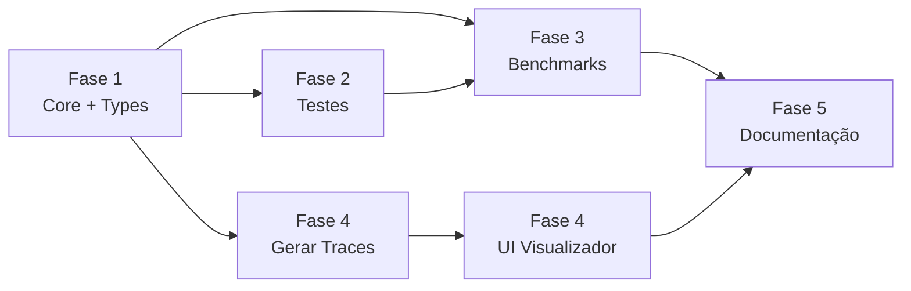

# Plano de Implementação — Módulo Kadane
> **Projeto:** Análise Comparativa Iterativo vs. Recursivo  
> **Problema:** Soma Máxima de Subarranjo (Algoritmo de Kadane)  
> **Responsável:** Allysson Bruno Chaves Assunção  
> **Versão do Plano:** 1.0 — 2026-10-02  
> **Status:** 🟡 Aguardando Execução

---

## Sumário das Fases

| # | Fase | Arquivos Principais | Status |
|---|------|----------------------|--------|
| 1 | Modelagem de Dados, Interfaces e Algoritmos Core | `types.py`, `iterative.py`, `recursive.py`, `tracer.py` | `[x]` |
| 2 | Bateria de Testes e Garantia de Equivalência | `test_iterative.py`, `test_recursive.py`, `test_equivalence.py` | `[x]` |
| 3 | Framework de Benchmarking e Métricas Empíricas | `runner.py`, `plot.py`, `results/` | `[ ]` |
| 4 | Visualizador Web Interativo Standalone | `index.html`, `app.js`, `style.css` | `[ ]` |
| 5 | Documentação, Integração e Apresentação Final | `README.md` (atualizado), `requirements.txt`, roteiro oral | `[ ]` |

---

## Regras Gerais para Agentes Executores

- **Linguagem:** Python 3.10+ com `from __future__ import annotations`, tipagem estrita via `type hints` e `dataclasses`.
- **Estilo:** PEP 8. Docstrings no padrão Google Style para todas as funções públicas.
- **Proibição:** Nenhum módulo de terceiros fora do `requirements.txt`. A UI usa somente Tailwind via CDN, sem build tools.
- **Atomicidade:** Cada tarefa `[ ]` deve ser completável por um agente independentemente. Nunca modificar um arquivo fora do escopo da tarefa corrente.
- **Sem código verbatim neste plano:** apenas contratos, assinaturas, schemas e critérios de aceitação.

---

## Fase 1 — Modelagem de Dados, Interfaces e Algoritmos Core

> **Objetivo:** Estabelecer as estruturas de dados compartilhadas e implementar os dois algoritmos puros (sem instrumentação), seguidos pela camada de rastreamento desacoplada.

### 1.1 Estrutura de Diretórios a Criar

```
kadane/src/
├── __init__.py          (vazio, torna src um pacote)
├── types.py
├── iterative.py
├── recursive.py
└── tracer.py
```

---

### 1.2 `src/types.py` — Dataclasses e Contratos de Dados

**Responsabilidade:** centralizar todos os tipos de dados trocados entre módulos.

#### 1.2.1 `SubarrayResult`

| Campo | Tipo | Descrição |
|-------|------|-----------|
| `max_sum` | `int` | Valor da soma máxima encontrada |
| `start_idx` | `int` | Índice inicial (inclusivo) do subarranjo ótimo |
| `end_idx` | `int` | Índice final (inclusivo) do subarranjo ótimo |

- Deve ser uma `dataclass` frozen (imutável).
- Deve implementar `__repr__` legível para saída nos testes.

#### 1.2.2 `StepEvent`

| Campo | Tipo | Descrição |
|-------|------|-----------|
| `step` | `int` | Número sequencial do passo (0-based) |
| `algorithm` | `str` | `"iterative"` ou `"recursive"` |
| `current_idx` | `int \| None` | Índice do elemento sendo processado neste passo |
| `max_current` | `int \| None` | Valor de `max_atual` neste passo (Kadane iterativo) |
| `max_global` | `int` | Melhor soma global até este passo |
| `active_start` | `int \| None` | Início do subarranjo ativo corrente |
| `active_end` | `int \| None` | Fim do subarranjo ativo corrente |
| `call_stack` | `list[CallStackFrame]` | Snapshot da pilha de chamadas neste passo |
| `event_type` | `str` | `"step"`, `"push"`, `"pop"`, `"result"` |
| `annotation` | `str \| None` | Texto explicativo opcional (ex: "reiniciou subarranjo") |

#### 1.2.3 `CallStackFrame`

| Campo | Tipo | Descrição |
|-------|------|-----------|
| `frame_id` | `int` | ID único crescente do frame |
| `fn_name` | `str` | Nome da função chamada |
| `low` | `int` | Parâmetro `low` passado à chamada |
| `high` | `int` | Parâmetro `high` passado à chamada |
| `mid` | `int \| None` | Ponto médio calculado (se aplicável) |
| `partial_result` | `SubarrayResult \| None` | Resultado parcial ao retornar (preenchido no evento `"pop"`) |
| `depth` | `int` | Profundidade na árvore de recursão (0 = raiz) |

**Definition of Done (DoD) da tarefa 1.2:**
- [x] Arquivo `types.py` criado com as três dataclasses acima.
- [x] Todas as dataclasses têm type hints completos e docstring de módulo explicando o propósito.
- [x] `from kadane.src.types import SubarrayResult, StepEvent, CallStackFrame` funciona sem erro.
- [x] `SubarrayResult` é imutável (modificar qualquer campo levanta `FrozenInstanceError`).

---

### 1.3 `src/iterative.py` — Algoritmo de Kadane Iterativo

**Responsabilidade:** Implementar o Kadane $O(n)$ / $O(1)$ puro com suporte opcional a rastreamento.

#### Assinatura da Função Pública

```
def kadane_iterative(
    arr: list[int],
    tracer: ExecutionTracer | None = None
) -> SubarrayResult
```

#### Contrato de Comportamento

| Caso de Entrada | Comportamento Esperado |
|-----------------|----------------------|
| `arr` vazio `[]` | Levantar `ValueError` com mensagem descritiva |
| `arr` unitário `[x]` | Retornar `SubarrayResult(max_sum=x, start_idx=0, end_idx=0)` |
| Todos negativos `[-3, -1, -2]` | Retornar o maior elemento individual (ex: `max_sum=-1, start=1, end=1`) |
| Misto com positivos | Retornar o subarranjo contíguo de soma máxima com índices corretos |

#### Invariante de Rastreamento

- Se `tracer` for fornecido (não-`None`), a cada iteração `k` deve chamar `tracer.record(StepEvent(...))`.
- O algoritmo base **não** deve importar `tracer.py`; recebe o tracer como dependência injetada.
- Sem tracer: desempenho puro, zero overhead.

**DoD da tarefa 1.3:**
- [x] Função `kadane_iterative` implementada e exportada em `src/__init__.py`.
- [x] Complexidade temporal $O(n)$ e espacial auxiliar $O(1)$ (excluindo tracer).
- [x] Retorna `SubarrayResult` correto para todos os casos de contrato da tabela acima.
- [x] Não importa `tracer.py` diretamente (injeção de dependência).

---

### 1.4 `src/recursive.py` — Divisão e Conquista

**Responsabilidade:** Implementar a abordagem recursiva $O(n \log n)$ / $O(\log n)$ pilha.

#### Assinaturas das Funções

```
# Pública — ponto de entrada
def kadane_recursive(
    arr: list[int],
    tracer: ExecutionTracer | None = None
) -> SubarrayResult

# Privadas — auxiliares internas
def _max_crossing_subarray(
    arr: list[int], low: int, mid: int, high: int,
    tracer: ExecutionTracer | None = None
) -> SubarrayResult

def _max_subarray_rec(
    arr: list[int], low: int, high: int,
    tracer: ExecutionTracer | None = None
) -> SubarrayResult
```

#### Contrato de Comportamento

| Caso de Entrada | Comportamento Esperado |
|-----------------|----------------------|
| `arr` vazio `[]` | Levantar `ValueError` (mesmo comportamento da versão iterativa) |
| `arr` unitário `[x]` | Retornar `SubarrayResult(max_sum=x, start_idx=0, end_idx=0)` |
| Todos negativos | Retornar o maior elemento individual (índices corretos) |
| Misto | Retornar `SubarrayResult` com `max_sum` **idêntico** ao da versão iterativa |

#### Invariante de Rastreamento

- `_max_subarray_rec` deve emitir evento `"push"` ao ser chamada e `"pop"` antes de retornar.
- `_max_crossing_subarray` deve emitir eventos `"step"` a cada passagem pelo laço interno.
- O frame incluído no evento deve carregar `low`, `high`, `mid`, `depth` e `partial_result` (no `"pop"`).

**DoD da tarefa 1.4:**
- [x] Função `kadane_recursive` e auxiliares implementadas.
- [x] Profundidade máxima de recursão para $N = 10^4$: $\leq \lceil \log_2 N \rceil + 2 = 16$ frames.
- [x] Resultado `max_sum` idêntico ao iterativo para qualquer entrada (validado nos testes de equivalência).
- [x] Eventos de push/pop emitidos corretamente no tracer (validado por inspeção em testes unitários).

---

### 1.5 `src/tracer.py` — Coletor de Eventos

**Responsabilidade:** Coletar, armazenar e serializar eventos de execução para JSON.

#### Assinatura da Classe

```
class ExecutionTracer:
    def record(self, event: StepEvent) -> None
    def get_trace(self) -> list[StepEvent]
    def to_json(self, indent: int = 2) -> str
    def save(self, path: str | Path) -> None
    def reset(self) -> None
```

#### Schema do Arquivo `trace.json` (saída de `to_json`)

```json
{
  "algorithm": "iterative" | "recursive",
  "input_array": [int, ...],
  "final_result": {
    "max_sum": int,
    "start_idx": int,
    "end_idx": int
  },
  "steps": [
    {
      "step": int,
      "algorithm": str,
      "current_idx": int | null,
      "max_current": int | null,
      "max_global": int,
      "active_start": int | null,
      "active_end": int | null,
      "call_stack": [
        {
          "frame_id": int,
          "fn_name": str,
          "low": int,
          "high": int,
          "mid": int | null,
          "partial_result": { "max_sum": int, "start_idx": int, "end_idx": int } | null,
          "depth": int
        }
      ],
      "event_type": "step" | "push" | "pop" | "result",
      "annotation": str | null
    }
  ]
}
```

**DoD da tarefa 1.5:**
- [x] `ExecutionTracer` criado com as 5 operações acima.
- [x] `to_json()` produz JSON válido que passa em `json.loads()` sem exceção.
- [x] O schema de saída está em conformidade com a especificação acima (validar com assertions nos testes de tracer).
- [x] `reset()` limpa completamente a lista interna; chamadas subsequentes produzem trace vazio.

---

## Fase 2 — Bateria de Testes Automatizados e Garantia de Equivalência

> **Objetivo:** Garantir corretude absoluta de ambos os algoritmos via pytest, com cobertura de todos os casos de borda e prova formal de equivalência de resultado.

### 2.1 Estrutura de Diretórios a Criar

```
kadane/tests/
├── __init__.py
├── test_iterative.py
├── test_recursive.py
└── test_equivalence.py
```

### 2.2 Conjuntos de Cenários Obrigatórios

Todos os cenários abaixo devem ser testados em `test_iterative.py` e `test_recursive.py` de forma independente:

| ID | Nome do Cenário | Array de Entrada | `max_sum` Esperado | `start_idx` | `end_idx` |
|----|-----------------|------------------|-------------------|-------------|-----------|
| T01 | Canônico Kadane | `[-2, 1, -3, 4, -1, 2, 1, -5, 4]` | `6` | `3` | `6` |
| T02 | Todos positivos | `[1, 2, 3, 4, 5]` | `15` | `0` | `4` |
| T03 | Todos negativos | `[-4, -1, -7, -2]` | `-1` | `1` | `1` |
| T04 | Array unitário positivo | `[42]` | `42` | `0` | `0` |
| T05 | Array unitário negativo | `[-7]` | `-7` | `0` | `0` |
| T06 | Contém zeros | `[0, -1, 2, 0, 3, -2]` | `5` | `2` | `4` |
| T07 | Elementos idênticos positivos | `[3, 3, 3, 3]` | `12` | `0` | `3` |
| T08 | Elementos idênticos negativos | `[-2, -2, -2]` | `-2` | `0` | `0` |
| T09 | Entrada vazia | `[]` | `ValueError` | — | — |
| T10 | Grande com ruído | Array de 1000 elementos (seed=42) | Calculado dinamicamente | — | — |

> **Nota para T10:** O valor esperado deve ser calculado uma vez com a implementação iterativa (considerada canônica) e usado como fixture fixture fixada para ambos os testes.

### 2.3 Testes de Tracer

Em `test_iterative.py` e `test_recursive.py`, incluir testes de instrumentação:

- Verificar que ao passar um `ExecutionTracer`, o número de eventos gravados é `>= len(arr)`.
- Verificar que o campo `algorithm` de todos os eventos é o valor correto.
- Para recursivo: verificar que os eventos `"push"` e `"pop"` existem e são balanceados (mesmo número).
- Para recursivo: verificar que a profundidade máxima de `CallStackFrame.depth` é $\leq \lceil \log_2 N \rceil + 1$.

### 2.4 `test_equivalence.py` — Invariante de Equivalência

**Invariante crítica:** Para qualquer array $A$ de comprimento $\geq 1$:
$$\text{kadane\_iterative}(A).\text{max\_sum} = \text{kadane\_recursive}(A).\text{max\_sum}$$

**Estratégia de teste:**
- Executar os 9 cenários manuais (T01–T09, exceto vazio) como subtests de equivalência.
- Executar 200 casos gerados aleatoriamente com seeds `0` a `199`, arrays de tamanho `1` a `50`, valores entre `-100` e `100`.
- O teste falha se qualquer par divergir.

**DoD da Fase 2:**
- [x] `pytest kadane/tests/` passa com 0 falhas e 0 erros.
- [x] Cobertura de código (`pytest --cov=kadane.src`) $\geq$ 90% em `iterative.py`, `recursive.py` e `tracer.py`.
- [x] Todos os 10 cenários manuais cobertos em ambos os arquivos de teste.
- [x] Invariante de equivalência validada para 200+ casos aleatórios reproduzíveis.
- [x] Eventos de tracer validados (push/pop balanceados para recursivo).

---

## Fase 3 — Framework de Benchmarking e Métricas Empíricas

> **Objetivo:** Coletar evidências empíricas quantitativas das diferenças de desempenho entre as abordagens e gerar relatórios e gráficos prontos para inclusão no trabalho.

### 3.1 Estrutura de Diretórios a Criar

```
kadane/benchmarks/
├── runner.py
├── plot.py
└── results/
    ├── (relatório .md gerado automaticamente)
    ├── (tabela .tex gerada automaticamente)
    ├── (grafico_tempo.png gerado automaticamente)
    └── (grafico_memoria.png gerado automaticamente)
```

### 3.2 `benchmarks/runner.py`

#### Parâmetros de Entrada Configuráveis (via constantes no topo do arquivo)

| Constante | Valor Padrão | Descrição |
|-----------|-------------|-----------|
| `N_VALUES` | `[10, 100, 1_000, 10_000, 100_000]` | Tamanhos de array a testar |
| `NUM_ROUNDS` | `30` | Rodadas por medição para calcular média/DP |
| `RANDOM_SEED` | `42` | Semente para reprodutibilidade |
| `VALUE_RANGE` | `(-1000, 1000)` | Faixa de valores inteiros nos arrays |

> **Atenção:** Para `N = 100_000`, a versão recursiva (Divisão e Conquista) **levantará `RecursionError`** em Python por exceder o limite padrão de recursão (~1000). O runner deve capturar essa exceção, registrar `None` para os campos de tempo/memória desse $N$, e continuar sem travar. Isso por si só já é um resultado científico relevante.

#### Métricas Coletadas por Rodada

| Métrica | Ferramenta Python | Unidade |
|---------|------------------|---------|
| Tempo de execução (wall-clock) | `time.perf_counter()` | segundos |
| Pico de alocação de memória | `tracemalloc.get_traced_memory()[1]` | bytes |
| Profundidade máxima de pilha de chamadas | Contador interno via tracer | inteiro |

#### Formato de Saída — `results/report.md`

O relatório Markdown deve conter:

1. **Cabeçalho** com data, seed e faixas de N usadas.
2. **Tabela comparativa geral** com colunas: `N`, `Iterativo Tempo Médio (s)`, `Iterativo Tempo DP`, `Recursivo Tempo Médio (s)`, `Recursivo Tempo DP`, `Speedup (Iter/Rec)`.
3. **Tabela de memória** com colunas: `N`, `Iterativo Pico Memória (bytes)`, `Recursivo Pico Memória (bytes)`.
4. **Tabela de pilha** com colunas: `N`, `Iterativo Frames Máx`, `Recursivo Frames Máx`.
5. **Observação sobre RecursionError** quando aplicável.

#### Formato de Saída — `results/table.tex`

Gerar a tabela comparativa principal em LaTeX (`tabular`) com `\hline`, pronta para colar em documento LaTeX/ABNT.

### 3.3 `benchmarks/plot.py`

Dependência: `matplotlib`. Deve ser importado somente neste arquivo (não em `runner.py`).

#### Gráfico 1 — `grafico_tempo.png`

- **Eixo X:** $N$ (escala log)
- **Eixo Y:** Tempo médio em segundos (escala log)
- **Séries:** Linha azul (Kadane Iterativo) + Linha vermelha (Recursivo D&C)
- **Referências teóricas:** Linha pontilhada cinza $O(n)$ e $O(n \log n)$ normalizadas
- **Marcadores:** Ponto circular para dados reais; "×" vermelho onde `RecursionError` ocorreu
- **Labels:** título, eixos e legenda em português

#### Gráfico 2 — `grafico_memoria.png`

- **Eixo X:** $N$ (escala log)
- **Eixo Y:** Pico de memória em KB (escala linear)
- **Séries:** Linha azul (Iterativo) + Linha vermelha (Recursivo)
- **Labels:** título, eixos e legenda em português

**DoD da Fase 3:**
- [ ] `python kadane/benchmarks/runner.py` executa sem travar (inclusive capturando `RecursionError`).
- [ ] Arquivos `results/report.md` e `results/table.tex` são gerados automaticamente.
- [ ] `python kadane/benchmarks/plot.py` gera `grafico_tempo.png` e `grafico_memoria.png` em `results/`.
- [ ] O Speedup calculado para $N = 10^4$ é $> 1.0$ (iterativo mais rápido) nos dados coletados.
- [ ] Os gráficos têm título, labels de eixo e legenda em português.

---

## Fase 4 — Visualizador Web Interativo Standalone

> **Objetivo:** Construir uma interface visual educacional que consuma o `trace.json` gerado pelo Python e permita reprodução passo a passo da execução de ambos os algoritmos, com destaque especial para a call stack da versão recursiva.

### 4.1 Estrutura de Diretórios a Criar

```
kadane/visualizer/
├── index.html
├── app.js
├── style.css
└── data/
    ├── trace_iterative_canonical.json
    ├── trace_recursive_canonical.json
    ├── trace_iterative_allneg.json
    └── trace_recursive_allneg.json
```

Os arquivos `.json` em `data/` são gerados rodando os algoritmos Python com tracer e salvando via `tracer.save()`. O processo deve ser documentado na Fase 5.

### 4.2 Contrato de Interface do `trace.json`

O visualizador deve suportar exatamente o schema definido na seção **1.5** deste plano. Qualquer divergência de schema deve ser tratada com uma mensagem de erro amigável na UI em vez de falha silenciosa.

### 4.3 Arquitetura da UI — `index.html`

A página deve ser **completamente standalone** (sem servidor, abrível com `File → Open` no navegador):

- Todo CSS de utilitário via `<link>` Tailwind CDN.
- Script `app.js` referenciado como `<script src="app.js" defer>`.
- Nenhuma requisição de rede além do CDN do Tailwind.

#### Layout da Página (3 colunas principais)

```
+---------------------------------------------------+
|  HEADER: Título + Seletor de Cenário + Seletor    |
|          de Algoritmo (Iterativo | Recursivo)      |
+------------------+---------------+----------------+
|  ARRAY VISUALIZER|  CALL STACK   |  PAINEL DE     |
|  (células do     |  INSPECTOR    |  MÉTRICAS E    |
|  vetor com cores)|  (pilha de    |  VARIÁVEIS     |
|                  |  frames)      |  LOCAIS        |
+------------------+---------------+----------------+
|  CONTROLES: [⏮] [⏪] [▶/⏸] [⏩] [⏭]  Speed: ━━━━ |
+---------------------------------------------------+
|  ANOTAÇÃO DO PASSO (texto explicativo do evento)  |
+---------------------------------------------------+
```

### 4.4 Componente: Array Visualizer

**Responsabilidade de renderização:**

- Exibir cada elemento do array como um bloco quadrado com o valor numérico centralizado.
- Colorização dinâmica por estado do elemento no passo corrente:

| Estado | Cor (classe Tailwind sugerida) |
|--------|-------------------------------|
| Elemento normal | `bg-gray-200` |
| Subarranjo ótimo final (`start_idx` a `end_idx`) | `bg-green-400` |
| Subarranjo ativo corrente | `bg-blue-300` |
| Elemento sob inspeção no passo atual (`current_idx`) | `bg-yellow-400 ring-2 ring-yellow-600` |

- Exibir índices numéricos abaixo de cada bloco.
- Exibir setas/labels indicando `start` e `end` do subarranjo ativo.

### 4.5 Componente: Call Stack Inspector

**Responsabilidade de renderização:**

- Renderizar a pilha de chamadas do passo atual como blocos empilhados verticalmente (o topo da pilha no topo da coluna visual).
- Cada frame exibe: `fn_name`, `[low, high]`, `mid` (se disponível) e `depth`.
- Ao evento `"push"`: animar o novo frame entrando pelo topo (deslizando de cima para baixo ou fade-in).
- Ao evento `"pop"`: animar o frame do topo saindo (deslizando para cima ou fade-out) e exibir brevemente `partial_result`.
- Para o algoritmo **iterativo**, esta coluna exibe sempre um único frame fixo com o estado do loop.
- A animação deve usar CSS transitions (`transition: all 300ms ease`).

### 4.6 Componente: Painel de Métricas e Variáveis Locais

Exibir os campos do `StepEvent` atual em tempo real:

| Campo | Label na UI | Formato |
|-------|------------|---------|
| `max_current` | `max_atual` | número inteiro (vermelho se negativo) |
| `max_global` | `max_global` | número inteiro em negrito |
| `active_start` | `início ativo` | índice inteiro ou `—` |
| `active_end` | `fim ativo` | índice inteiro ou `—` |
| `step` | `Passo` | `k / total` |
| `event_type` | `Evento` | badge colorido (`step`, `push`, `pop`, `result`) |

### 4.7 Controles de Reprodução — `app.js`

| Botão | Ícone | Ação |
|-------|-------|------|
| Reset | ⏮ | `currentStep = 0`, renderizar passo 0 |
| Step Back | ⏪ | `currentStep = max(0, currentStep - 1)`, renderizar |
| Play/Pause | ▶/⏸ | Alternar `isPlaying`; loop com `setInterval(speed)` |
| Step Next | ⏩ | `currentStep = min(total-1, currentStep + 1)`, renderizar |
| End | ⏭ | `currentStep = total - 1`, renderizar passo final |

- **Speed Slider:** controla o intervalo do `setInterval` entre `100ms` (rápido) e `2000ms` (lento).
- O Play para automaticamente ao atingir o último passo.

### 4.8 Seletor de Cenários e Algoritmos

- Dropdown de cenários: `Canônico`, `Apenas Negativos`, `Array Unitário`, `Customizado`.
- Radio buttons ou toggle: `Iterativo` / `Recursivo`.
- Ao mudar qualquer seletor: carregar o `trace.json` correspondente de `data/` via `fetch()` relativo e reiniciar do passo 0.

> **Nota sobre Customizado:** No modo customizado, exibir um `<textarea>` para o usuário colar um array JSON. Um botão "Gerar Trace" deve ser desabilitado com uma tooltip explicando que requer rodar o script Python — a UI não executa código Python.

**DoD da Fase 4:**
- [ ] `index.html` abre corretamente no Chrome/Firefox sem servidor (protocolo `file://`).
- [ ] Todos os 5 controles de reprodução funcionam corretamente.
- [ ] Ao mudar de cenário/algoritmo, o trace correto é carregado e a animação reinicia.
- [ ] A Call Stack Inspector anima push/pop visivelmente.
- [ ] O Array Visualizer colore corretamente `current_idx`, `active_start`→`active_end` e resultado final.
- [ ] A UI não trava com arrays de até 50 elementos (número máximo nos traces de demonstração).
- [ ] Testado nos navegadores Chrome e Firefox (últimas versões estáveis).

---

## Fase 5 — Documentação, Integração e Roteiro de Apresentação

> **Objetivo:** Empacotar toda a implementação com documentação clara, instruções executáveis e um roteiro de apresentação oral para defesa do trabalho.

### 5.1 `requirements.txt`

Lista mínima de dependências com versões fixadas (`==`):

| Pacote | Uso |
|--------|-----|
| `pytest` | Execução de testes |
| `pytest-cov` | Relatório de cobertura |
| `matplotlib` | Geração de gráficos em `plot.py` |

> `tracemalloc` e `time` são módulos da stdlib; não devem aparecer no `requirements.txt`.

### 5.2 Atualização do `kadane/README.md`

O README existente (teórico) deve ganhar uma nova seção **"Como Executar"** com os seguintes blocos de comando documentados:

#### Bloco 1 — Instalação

```
# (No diretório raiz do projeto)
pip install -r kadane/requirements.txt
```

#### Bloco 2 — Testes Unitários

```
pytest kadane/tests/ -v --cov=kadane.src --cov-report=term-missing
```

#### Bloco 3 — Benchmarks

```
python kadane/benchmarks/runner.py
python kadane/benchmarks/plot.py
```

Resultados salvos em `kadane/benchmarks/results/`.

#### Bloco 4 — Gerar Traces para o Visualizador

```
python kadane/scripts/generate_traces.py
```

> **Nota:** Criar um script auxiliar `kadane/scripts/generate_traces.py` que instancia ambos os algoritmos com tracer para os cenários canônicos e salva os `.json` em `kadane/visualizer/data/`. Esse script deve ser documentado neste bloco.

#### Bloco 5 — Abrir o Visualizador

```
# Windows
start kadane/visualizer/index.html

# Linux/Mac
open kadane/visualizer/index.html
```

### 5.3 Roteiro de Apresentação Oral

Incluir no final do README (ou em `kadane/APRESENTACAO.md`) um roteiro estruturado em tópicos para a defesa presencial:

| # | Tópico | Duração Sugerida | Artefato de Suporte |
|---|--------|-----------------|---------------------|
| 1 | Definição formal do problema e casos de borda | 2 min | Quadro / slide teórico |
| 2 | Demonstração ao vivo do Visualizador — Kadane Iterativo | 3 min | `index.html` no navegador |
| 3 | Demonstração ao vivo do Visualizador — Recursivo (call stack) | 3 min | `index.html` no navegador |
| 4 | Resultados empíricos de benchmark (gráficos) | 2 min | `grafico_tempo.png`, `grafico_memoria.png` |
| 5 | Análise comparativa e conclusão: por que Iterativo vence | 2 min | Tabela `report.md` |

**DoD da Fase 5:**
- [ ] `requirements.txt` criado com todas as dependências versionadas.
- [ ] `kadane/scripts/generate_traces.py` criado e documentado.
- [ ] `README.md` atualizado com seção "Como Executar" contendo todos os 5 blocos de comando.
- [ ] Roteiro de apresentação incluído (no README ou em `APRESENTACAO.md`).
- [ ] Todo o fluxo (`install → test → benchmark → generate_traces → open visualizer`) testado de ponta a ponta sem erros.

---

## Checklist Global de Conclusão do Projeto

```
Fase 1 — Core
[x] types.py criado com SubarrayResult, StepEvent, CallStackFrame
[x] iterative.py com kadane_iterative e injeção de tracer
[x] recursive.py com kadane_recursive, _max_crossing_subarray, _max_subarray_rec
[x] tracer.py com ExecutionTracer (record, get_trace, to_json, save, reset)

Fase 2 — Testes
[x] test_iterative.py com 10 cenários + testes de tracer
[x] test_recursive.py com 10 cenários + testes de tracer
[x] test_equivalence.py com 200+ casos aleatórios
[x] Cobertura >= 90% confirmada

Fase 3 — Benchmarks
[ ] runner.py coleta tempo, memória, profundidade de pilha
[ ] runner.py captura RecursionError e continua
[ ] report.md e table.tex gerados automaticamente
[ ] plot.py gera grafico_tempo.png e grafico_memoria.png

Fase 4 — Visualizador
[ ] index.html standalone com layout 3 colunas
[ ] app.js com 5 controles + speed slider + seletor de cenário
[ ] Call Stack Inspector com animação push/pop
[ ] Array Visualizer com colorização dinâmica
[ ] style.css com estilos da pilha e células
[ ] 4 traces JSON de demonstração gerados em data/

Fase 5 — Documentação
[ ] requirements.txt criado
[ ] generate_traces.py criado
[ ] README.md atualizado com How-To completo
[ ] Roteiro de apresentação escrito
[ ] Fluxo end-to-end testado
```

---

## Dependências entre Fases



> **Regra:** A Fase 2 deve passar 100% antes de qualquer trabalho nas Fases 3, 4 e 5. A UI (Fase 4) pode ser desenvolvida em paralelo com os Benchmarks (Fase 3) desde que os traces de demonstração já estejam gerados.

---

*Plano gerado por agente de planejamento em 2026-10-02. Versão controlada pelo Git.*
